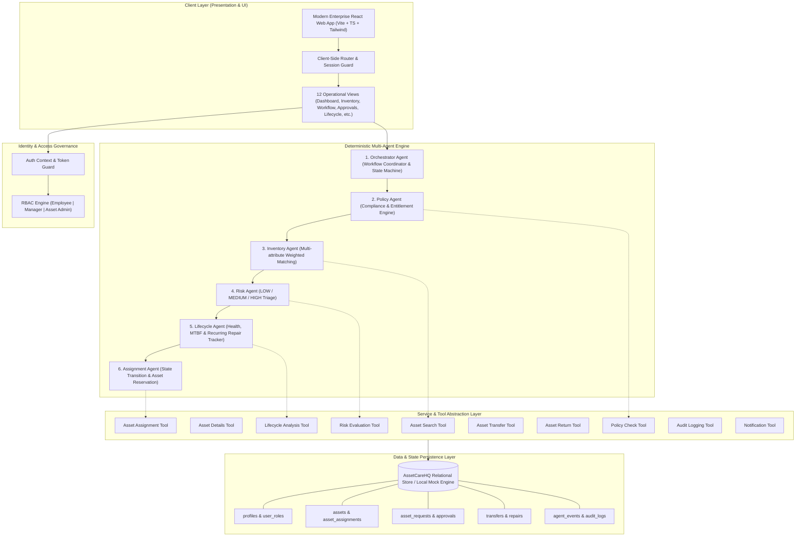
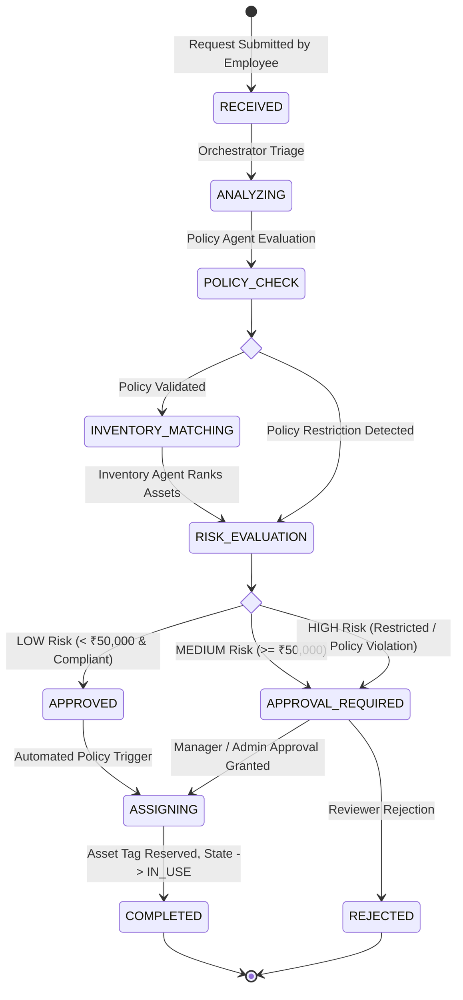

# AssetCareHQ — Enterprise Architecture Documentation

## 1. Executive Summary
**AssetCareHQ** is an Intelligent IT Asset Lifecycle & Operations Platform architected as an academic prototype for deterministic multi-agent orchestration. It demonstrates how autonomous agents can coordinate complex enterprise IT workflows—from asset procurement, inventory matching, and policy governance to risk evaluation, automated assignments, and lifecycle maintenance—while maintaining strict auditability and human-in-the-loop controls.

---

## 2. System Architecture Diagram

---

## 3. Multi-Agent Workflow Design

The core execution path for an asset request proceeds through a strict deterministic state machine:

### Deterministic Asset Matching Formula
The Inventory Agent ranks available candidates using multi-factor normalized scoring:
$$\text{Score} = (\text{RAM} \times 0.30) + (\text{Storage} \times 0.20) + (\text{CPU} \times 0.25) + (\text{Age} \times 0.15) + (\text{Location} \times 0.10)$$

### Lifecycle Health & Replacement Formula
The Lifecycle Agent calculates replacement urgency (0–100):
$$\text{Score} = \text{Age Score (25)} + \text{Warranty Expiry (20)} + \text{Repair Frequency (20)} + \text{Health Degradation (20)} + \text{Performance (15)}$$
- **0–39:** Healthy
- **40–69:** Monitor
- **70–100:** Replacement Recommended (Flags recurring repairs $\ge 3$ for identical failure modes).

---

## 4. Security & Access Governance Model

1. **Role-Based Access Control (RBAC):**
   - **Employee:** Submit requests, view personal assigned inventory, monitor workflow trace for personal tickets.
   - **Manager:** Employee privileges + review and approve/reject medium-risk tickets and inter-department asset transfers.
   - **Asset Admin:** Full supervisory access, manual asset assignments/returns/offboarding, role management, high-risk reviews, and demo scenario triggering.

2. **Immutable Audit Logging:**
   - Every state transition, agent tool invocation, human approval, asset status change, and transfer is logged to `audit_logs` with actor details, timestamps, and target resource identifiers.
   - Normal users are prevented from altering or purging historical audit logs.

3. **Safe Credentials & Mock Isolation:**
   - Zero hardcoded cloud secrets or private keys in the frontend source bundle.
   - Deterministic simulations eliminate runtime LLM cost, hallucination risk, and external API rate limit vulnerabilities.

---

## 5. Monitoring & Operational Metrics

The platform incorporates real-time operational telemetry across three analytical axes:
- **Agent Health & Execution Counts:** Run counts, success rates, and mean stage latencies (75–235ms simulation bounds).
- **Pipeline Throughput:** Open requests, pending human approvals, auto-approval ratio, and rejection rates.
- **Hardware Fleet Utilization:** Active vs. available inventory counts, warranty expiration pipeline, and proactive replacement candidates.

---

## 6. Deployment Strategy

- **Build Output:** Static, tree-shaken SPA bundle produced via Vite (`npm run build`).
- **Target Hosting:** Edge CDN platforms (Vercel, Netlify, Cloudflare Pages, or AWS S3 + CloudFront).
- **Environment Parity:** The application runs out of the box in both offline mock mode (using seeded local persistence) and connected mode (via Supabase PostgreSQL with Row Level Security).
